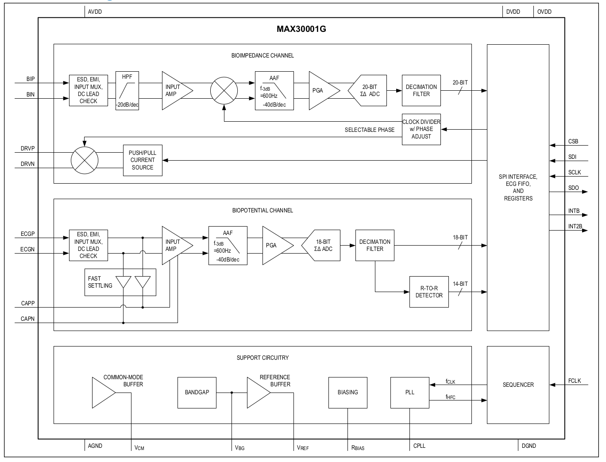
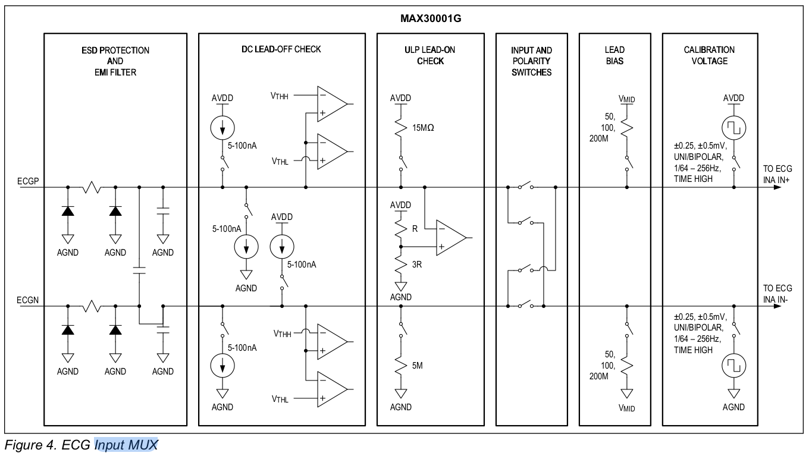
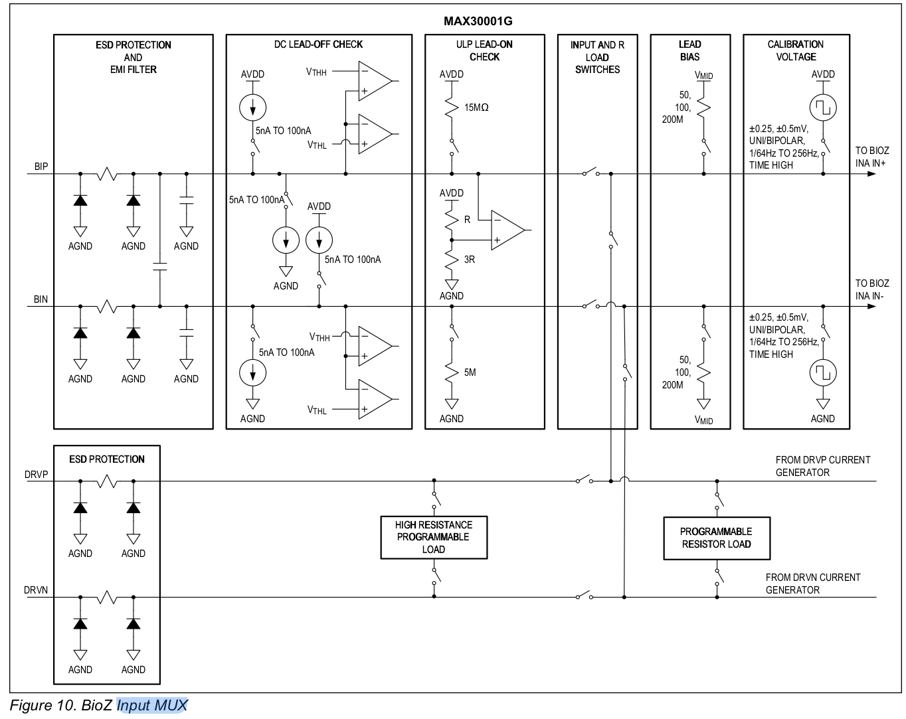

# Maxim 30001 Arduino Library

This is the MAX30001 library for Arduino. It attempts to be `complete` and supports impedance spectroscopy.

This library has been validated for ECG, continuous BIOZ, combined ECG+BIOZ, internal calibration paths, and the refactored nonblocking BIOZ scan flow that is driven through `setup...()`, `start()`, and repeated `update()`.

Impedance Spectroscopy: Internal `1 kOhm` resistor scan validation working across the full `128 kHz` down to `125 Hz` scan range. External known-load validation is still required before calling library production ready.

# Installation

Install the library in Arduino IDE or clone the GitHub repository into your Arduino `libraries` folder.

# Dependencies

This driver depends on
- [Arduino Ring Buffer](https://github.com/uutzinger/Arduino_RingBuffer)
- [Arduino Logger](https://github.com/uutzinger/logger)

# Documentation
- [API Documentation (generated)](https://uutzinger.github.io/Arduino_MAX30001G/)
- [Global Variables](Global%20Variables.md)
- [Interrupt Handling](Interrupts.md)
- [Changelog](CHANGELOG.md)

# Hardware with MAX30001G

- [MediBrick ECG and BIOZ](https://github.com/MediBrick/ECG_BIOZ_Brick)
- [Protocentral tinyECG](https://protocentral.com/product/protocentral-tinyecg-max30001-ecg-respiration-module-for-qt-py-xiao/)
- [Protocentral MAX30001](https://protocentral.com/product/protocentral-max30001/)
- [Protocentral Healthy Pi 5](https://protocentral.com/product/healthypi-5-vital-signs-monitoring-hat-kit)
- [Protocentral Healthy Pi Move](https://protocentral.com/product/healthypi-move/)

# Quick Start

Using Arduino-style `setup()` / `loop()` with `setup` + `start/update/stop`:

```cpp
#include <Arduino.h>
#include "max30001g.h"
#include "logger.h"

const uint8_t AFE_CS_PIN  = 10; // SPI chip select pin
const int AFE_INT1_PIN = 2;     // AFE INTB interrupt
const int AFE_INT2_PIN = -1;    // AFE INT2B optional

MAX30001G afe(AFE_CS_PIN, AFE_INT1_PIN, AFE_INT2_PIN);
bool measurementRunning = false; // Global status

void setup() {
  // LOG_LEVEL_NONE, LOG_LEVEL_ERROR, LOG_LEVEL_WARN, LOG_LEVEL_INFO, LOG_LEVEL_DEBUG
  currentLogLevel = LOG_LEVEL_DEBUG;

  Serial.begin(115200);         // Baudrate, up to 921600 for ESP

  afe.begin();

  // Configure for ECG and BIOZ
  afe.setupECGandBIOZ(
    1, 2, true,        // ECG: speed=256sps, gain=80V/V, 3-lead
    0, 1,              // BIOZ: speed=25sps, gain=20V/V
    1, 0,              // BIOZ: DLPF=4Hz, DHPF=bypass
    8000, 8000, 0.0,   // BIOZ: frequency=8kHz, current[nA], phase[deg]
    true, false, false // leadbias=enabled, leadsoffdetect=off, bioz fourleads=false
  );
}

void loop() {
  // PSEUDO CODE: replace with your own user-action logic.
  bool userRequestedStart = /* e.g., UI/event says "start" */ false;
  bool userRequestedStop  = /* e.g., UI/event says "stop"  */ false;

  if (userRequestedStart && !measurementRunning) {
    afe.start();
    measurementRunning = true;
  }

  if (userRequestedStop && measurementRunning) {
    afe.stop();
    measurementRunning = false;
  }

  if (!measurementRunning) {
    return;
  }

  // Service IRQs and drain FIFOs.
  if (afe.update()) { // Check for pending interrupts and service them
    float value = 0.0f;

    // Print all new ECG samples collected during update().
    while (ECG_data.available() > 0) {
      ECG_data.pop(value);
      Serial.print("ECG [mV]: ");
      Serial.println(value, 3);
    }

    // Print all new BIOZ samples collected during update().
    while (BIOZ_data.available() > 0) {
      BIOZ_data.pop(value);
      Serial.print("BIOZ [ohm]: ");
      Serial.println(value, 3);
    }

    // Print all new RTOR samples collected during update().
    while (RTOR_data.available() > 0) {
      RTOR_data.pop(value);
      Serial.print("RR [ms]: ");
      Serial.println(value, 1);
      if (value > 0.0f) {
        Serial.print("HR [bpm]: ");
        Serial.println(60000.0f / value, 1);
      }
    }
  }
}
```

BIOZ spectroscopy uses the same configure/start/update lifecycle, but `setupBIOZScan(...)` only configures the scan. Call `start()` once, then keep calling `update()` until a spectrum becomes available in `BIOZ_spectrum`.

# Main Sketch

The sketch that reflects the latest driver organization most closely is `examples/MAX30001G/MAX30001G.ino`.

It is an interactive serial utility for exercising the current driver layers, switching modes, applying settings, running health checks, and validating scan/calibration flows from one sketch.

When you open the serial monitor and type `?`, the sketch prints this help menu:

```text
================================================================================
| MAX30001G ECG and Bio-Impedance Program                                      |
| 2026 Urs Utzinger & GPT                                                      |
================================================================================
| GENERAL COMMANDS                       | DATA COMMANDS                       |
|----------------------------------------|-------------------------------------|
| ?: help screen                         | z: toggle data display on/off       |
| s: show current settings               | c: reset sample counter             |
| h: run health check                    | (: save config snapshot             |
| i: print device info                   | ): restore config snapshot          |
| r: print all registers                 | p: print config registers           |
| t: print status registers              | f: FIFO reset                       |
|========================================|=====================================|
| OPERATION MODES (auto-stop previous)   | START/STOP                          |
|----------------------------------------|-------------------------------------|
| m1: ECG mode                           | .: toggle start/stop                |
| m2: BIOZ mode                          | >: start measurement                |
| m3: ECG + BIOZ mode                    | <: stop measurement                 |
| m4: ECG signal calibration             |                                     |
| m5: BIOZ signal calibration            |                                     |
| m6: BIOZ internal impedance            |                                     |
| m7: BIOZ external impedance            |                                     |
| m8: BIOZ impedance spectroscopy        |                                     |
|========================================|=====================================|
| ECG SETTINGS                           | BIOZ SETTINGS                       |
|----------------------------------------|-------------------------------------|
| Es<n>: speed      (0-2)     Es1        | Bs<n>: speed      (0-1)     Bs0     |
| Eg<n>: gain       (0-3)     Eg2        | Bg<n>: gain       (0-3)     Bg1     |
| El<n>: dig LPF    (0-3,255) El255      | Ba<n>: analog HPF (0-7)     Ba1     |
| Eh<n>: dig HPF    (0-1,255) Eh255      | Bd<n>: digital LPF(0-3)     Bd1     |
| Ee<n>: leads      (2 or 3)  Ee3        | Bh<n>: digital HPF(0-3)     Bh0     |
| Er<n>: R-to-R     (0=off,1) Er1        |                                     |
| En<n>: notch  (0=off,50,60) En0        |                                     |
| Eq<n>: notch Q    (1-100)   Eq20       |                                     |
|                                        | Bf<n>: frequency Hz         Bf8000  |
|                                        | Bc<n>: current nA           Bc8000  |
|                                        | Bp<n>: phase deg            Bp0     |
|                                        | Bl<n>: lead bias  (0=off,1) Bl1     |
|                                        | Bo<n>: lead-off   (0=off,1) Bo0     |
|                                        | Bw<n>: wires      (2 or 4)  Bw2     |
|========================================|=====================================|
| SCAN SETTINGS                          | CALIBRATION SETTINGS                |
|----------------------------------------|-------------------------------------|
| Sa<n>: averages   (1-8)     Sa8        | Cr<n>: internal resistor    Cr1000  |
| Sf<n>: fast mode  (0=off,1) Sf0        | Cm<n>: cal modulation(0-3)  Cm0     |
| Sr<n>: full range (0=off,1) Sr0        | Cf<n>: mod frequency(0-4)   Cf3     |
| Si<n>: source     (0=ext,1=int) Si0    | Ce<n>: ECG sig mode(0/1)   Ce1     |
| Sp<n>: phase rng  (0=full,1) Sp0       | Cb<n>: BIOZ sig mode(0/1)  Cb0     |
| Sh<n>: int AHPF   (255,0-7) Sh255      |                                     |
| St<n>: settle     (1-64)    St24       |                                     |
| Sc<n>: cur settle (1-64)    Sc24       |                                     |
|========================================|=====================================|
| LOG LEVEL                              | SPECIAL                             |
|----------------------------------------|-------------------------------------|
| l0: none (silent)                      | w: software reset                   |
| l1: errors only                        | y: synchronize                      |
| l2: warnings                           | k: clear latched status flags       |
| l3: info (default)                     | a: apply current settings (re-setup)|
| l4: debug (verbose)                    |                                     |
================================================================================

Examples:
  m1       - Switch to ECG mode
  Eg3      - Set ECG gain to 160 V/V (level 3)
  Bf40000  - Set BIOZ frequency to 40 kHz
  .        - Start/stop measurement
  z        - Toggle continuous data display
```


# Example Sketches

**`examples/MAX30001G/MAX30001G.ino`**: interactive serial test program covering all options of the software including mode switches, setup helpers, calibration, scan control, and register inspection.

The other maintained example sketches match the current driver structure:

- `examples/ECG/ECG.ino`: continuous ECG using `setupECG(...)`, `start()`, and repeated `update()`
- `examples/BIOZ/BIOZ.ino`: continuous fixed-frequency BIOZ using `setupBIOZ(...)`
- `examples/ECGandBIOZ/ECGandBIOZ.ino`: simultaneous ECG and BIOZ using `setupECGandBIOZ(...)`
- `examples/BIOZScan/BIOZScan.ino`: external nonblocking BIOZ spectroscopy using `setupBIOZScan(...)`
- `examples/BIOZScan_Internal/BIOZScan_Internal.ino`: internal-resistor scan validation using the same scan-owned state machine
- `examples/BIOZScan_Internal_Fast/BIOZScan_Internal_Fast.ino`: fast reduced-phase internal-resistor full-spectrum validation
- `examples/Hardware_HealthCheck/Hardware_HealthCheck.ino`: startup communication and hardware checks
- `examples/ECG_FIFOInterruptValidation/ECG_FIFOInterruptValidation.ino`: ECG FIFO interrupt and `ECG_data` validation
- `examples/BIOZ_FIFOInterruptValidation/BIOZ_FIFOInterruptValidation.ino`: BIOZ FIFO interrupt and `BIOZ_data` validation
- `examples/ECGandBIOZ_FIFOInterruptValidation/ECGandBIOZ_FIFOInterruptValidation.ino`: combined FIFO drain validation
- `examples/BIOZ_Internal_ImpedanceCalibration/BIOZ_Internal_ImpedanceCalibration.ino`: internal BIST point measurements outside the scan flow
- `examples/BIOZ_External_ImpedanceCalibration/BIOZ_External_ImpedanceCalibration.ino`: external known-load impedance calibration
- `examples/BIOZ_SignalCalibration/BIOZ_SignalCalibration.ino` and `examples/ECG_SignalCalibration/ECG_SignalCalibration.ino`: internal signal-generator calibration paths

# Contributing

- Urs Utzinger, 2025-2026
- GPT, 2025- 2026

# License

See [LICENSE](License.txt).

# Block Diagram of MAX 30001G

The MAX30001G is a highly integrated analog front end that consists of a differential `ECG channel` with optional right-leg drive. It employs standard high-pass and low-pass filters, an instrumentation amplifier, and an analog-to-digital converter.

The impedance unit consists of a current driver, analog high-pass filter, and phase-shifted demodulator to measure impedance from 128kHz down to 125Hz modulation frequency at varying phase shifts. Internal-BIST validation shows coherent full-spectrum scans with dynamic AHPF selection, but the low-frequency end still rolls off below about 1kHz and external known-load validation is still required for production scan calibration.

<a href="assets/Blockdiagram.png" target="_blank">
  
</a>

# Input MUX ECG

Besides ESD protection, the input MUX can detect lead-off and lead-on conditions. In addition, it can switch input electrode polarity and correct common-voltage bias on the subject. Input can be turned off and replaced with an internal signal generator for testing purposes.

<a href="assets/ECG_InputMUX.png" target="_blank">
  
</a>

# Input MUX BIOZ
Similar to the ECG input MUX, the BIOZ input MUX has ESD protection as well as lead-on and lead-off detection. Besides input signal calibration, a programmable resistor can be measured internally as simulated impedance.

<a href="assets/BIOZ_InputMUX.png" target="_blank">
  
</a>
